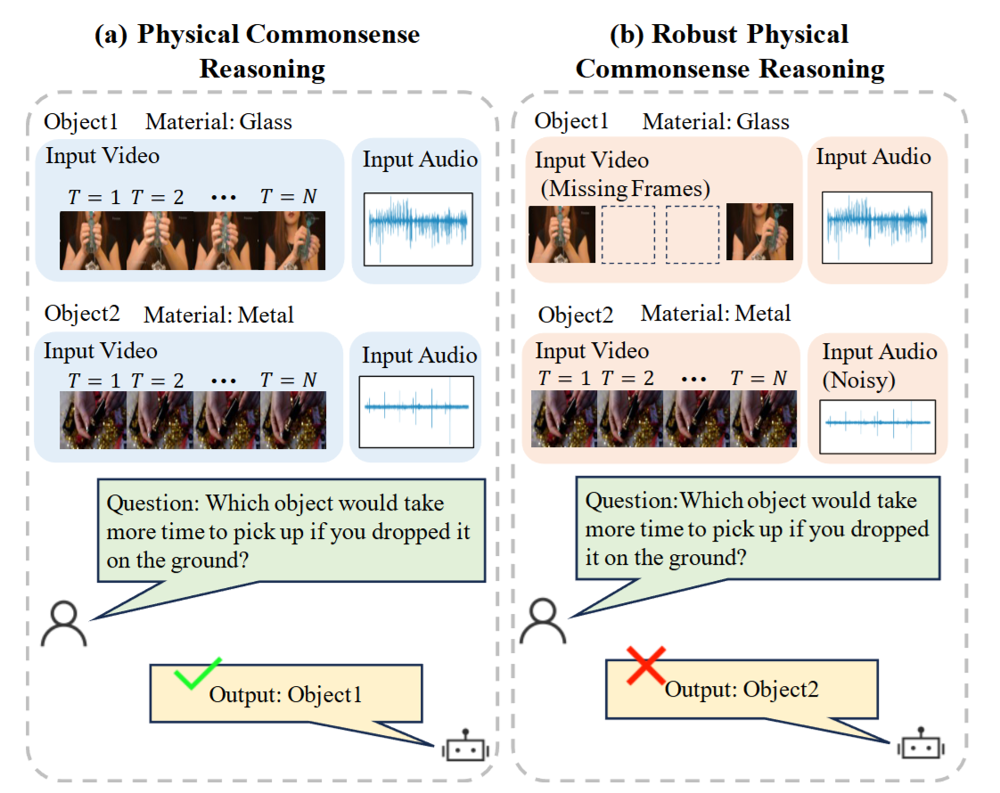
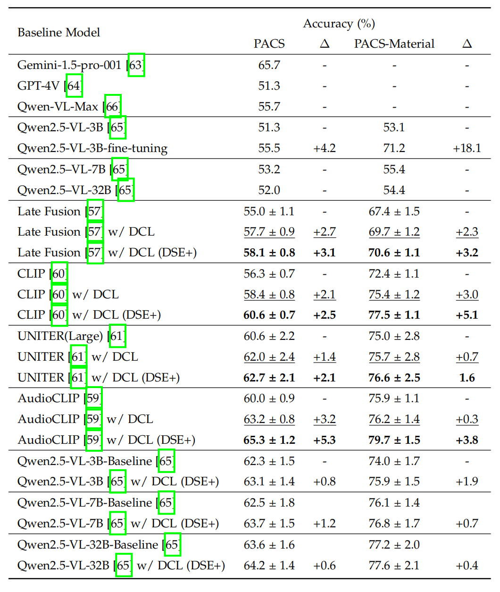

<div align="center" style="font-family: charter;">

<h1><i>RDCL</i>:</br> Robust Disentangled Counterfactual Learning for Physical Audiovisual Commonsense Reasoning</h1>


<br />

<a href="https://arxiv.org/abs/2310.19559" target="_blank">
    
</a>
<a href="https://arxiv.org/abs/2502.12425" target="_blank">
    
</a>
<a href="https://pan.baidu.com/s/1Ei76NNkb1CFt8FJkDJDFMg" target="_blank">
    
</a>

<div>
    <a href="https://jueduilingdu.github.io/">Mengshi Qi</a><sup>1</sup>,
    <a href="https://scholar.google.com/citations?user=iFz5h28AAAAJ&hl=zh-CN" target="_blank">Changsheng Lv</a><sup>1</sup>,
    <a href="https://teacher.bupt.edu.cn/mahuadong/en/index.htm" target="_blank">Huadong Ma</a><sup>1</sup>,
</div>

<div>
    <sup>1</sup> Beijing University of Posts and Telecommunications &emsp;
</div>

<p align="justify"><i>Can machines reason about the physical world using both sight and sound, just as humans do, even when one sense is missing? Physical audiovisual commonsense reasoning demands not only perceiving objects and their interactions, but also imagining counterfactual outcomes under varying conditions. Yet most models struggle to disentangle time-invariant object properties from time-varying dynamics, and falter when modalities like audio or video are absent. To bridge this gap, we propose <b>Robust Disentangled Counterfactual Learning (RDCL)</b>: a plug-and-play framework that (1) disentangles static and dynamic factors via a variational sequential encoder, (2) enhances causal reasoning through counterfactual intervention over physical relationships, and (3) robustly handles missing modalities by separating shared and modality-specific features. RDCL seamlessly integrates with any vision-language model, enabling more human-like, robust, and explainable physical reasoning in the real world.</i></p>

</div>

## Updates
- `2025-10-25` 🎉 Paper accepted to **TPAMI 2025**!

- `2025-07-24` 🚀 Added inference and fine-tuning code for **Qwen2.5-VL** on PACS, along with new distance metrics for physical knowledge correlation.
- `2025-02-17` ❤️ Released extended version **RDCL** (Robust Disentangled Counterfactual Learning) for **audiovisual** physical reasoning with missing modalities.
- `2023-12-10` 🎉 Paper accepted to **NeurIPS 2023**!

## Contents

- [Updates](#updates)
- [Contents](#contents)
- [Paper](#paper)
- [Dataset](#dataset)
- [Download Model Weights](#download-model-weights)
- [Requirements](#requirements)
- [Training](#training)
- [Prediction](#prediction)
- [Qwen2.5-VL Integration](#qwen25-vl-integration)
- [Baseline with Qwen Visual Encoder](#baseline-with-qwen-visual-encoder)
- [Acknowledgements](#acknowledgements)
- [Citation](#citation)

## Paper

- **NeurIPS 2023**: [Disentangled Counterfactual Learning for Physical Commonsense Reasoning](https://arxiv.org/pdf/2310.19559)
- **arXiv 2025 (Extended)**: [Robust Disentangled Counterfactual Learning for Physical Audiovisual Commonsense Reasoning (RDCL)](https://arxiv.org/pdf/2502.12425)

## Dataset

We use the **PACS** dataset for physical reasoning and a **Material Classification** dataset for attribute disentanglement.  
The extended RDCL dataset (with VLM-generated object descriptions and audio) is available via Baidu Netdisk:
- 🔗 [Baidu Netdisk](https://pan.baidu.com/s/1Ei76NNkb1CFt8FJkDJDFMg) (Extraction Code: `v458`)

## Results



## Download Model Weights

Place all downloaded assets into the `assets/` folder.

### CLIP
```bash
wget https://openaipublic.azureedge.net/clip/models/5806e77cd80f8b59890b7e101eabd078d9fb84e6937f9e85e4ecb61988df416f/ViT-B-16.pt
```

### AudioCLIP
Download from [AudioCLIP Releases](https://github.com/AndreyGuzhov/AudioCLIP/releases ):
- `AudioCLIP-Partial-Training.pt`
- `bpe_simple_vocab_16e6.txt.gz`

## Requirements

- Python 3.8.10  
- PyTorch 1.11.0  
- CUDA 11.3  

```bash
conda create --name dcl python=3.8
conda activate dcl
pip install -r requirements.txt
```

## Training

### DCL (NeurIPS 2023 Version)
```bash
# PACS
python3 train_1.py

# Material Classification
python3 train_classify.py
```

### RDCL (TPAMI 2025) – with missing modalities
```bash
# e.g., missing audio
python3 train_1.py --miss_modal audio
python3 train_classify.py --miss_modal audio
```

## Prediction

```bash
python3 predict.py -model_path PATH_TO_MODEL_WEIGHTS -split test
```

## Qwen2.5-VL Integration

### Data Processing
```bash
# Inference data
python3 PACS_data/scripts/processing_qwen_inference_multi_video_data.py

# Fine-tuning data
python3 PACS_data/scripts/processing_qwen_finetune_data.py
```

### Inference
```bash
python PACS_inference.py \
  --model_dir Qwen/Qwen2.5-VL-3B-Instruct \
  --tokenizer_dir Qwen/Qwen2.5-VL-3B-Instruct \
  --split test --data_type data
```

### Fine-tuning
```bash
cd qwen-vl-finetune
sh scripts/sft_PACS.sh
```
> ✅ Trained on 4×V100 GPUs. See [Qwen2.5-VL Finetune](https://github.com/QwenLM/Qwen2.5-VL/tree/main/qwen-vl-finetune ) for details.

## Baseline with Qwen Visual Encoder

To accelerate training, we extract visual features offline.

### Feature Extraction
```bash
# Video frames
python3 extract_feature.py --model_size 3B
python3 extract_feature.py --model_size 7B
python3 extract_feature.py --model_size 32B

# Single images
python3 extract_feature_single_image.py --model_size 3B
```

### Training Baseline
```bash
python3 train_qwen_baseline.py --Qwen2_5_Size 3B
```

### Alternative Distance Metrics
```bash
python3 train_qwen_baseline.py --sim_type euclidean
python3 train_qwen_baseline.py --sim_type manhattan
```

## Acknowledgements

This project builds upon open-source efforts from:
- [AudioCLIP](https://github.com/AndreyGuzhov/AudioCLIP )
- [PACS](https://github.com/samuelyu2002/PACS )

We sincerely thank Andrey Guzhov, Samuel Yu, and the broader research community for their foundational contributions.

## Citation

If you find our work useful, please cite:

```bibtex
@inproceedings{lv2023disentangled,
  title={Disentangled Counterfactual Learning for Physical Commonsense Reasoning},
  author={Lv, Changsheng and Qi, Mengshi and Li, Xia and Yang, Zhengyuan and Ma, Huadong},
  booktitle={Advances in Neural Information Processing Systems (NeurIPS)},
  year={2023}
}

@ARTICLE{11222969,
  author={Qi, Mengshi and Lv, Changsheng and Ma, Huadong},
  journal={IEEE Transactions on Pattern Analysis and Machine Intelligence}, 
  title={Robust Disentangled Counterfactual Learning for Physical Audiovisual Commonsense Reasoning}, 
  year={2025},
  volume={},
  number={},
  pages={1-14},
  doi={10.1109/TPAMI.2025.3627224}}

```

⭐ Don’t forget to star this repo if you find it helpful!

